# Portfolio Développeur Web & Mobile / Web & Mobile Developer Portfolio

## Description
Portfolio complet et impressionnant pour un développeur web & web mobile en formation, avec un design ténébreux/sombre, minimaliste, inspiré de l'univers anime/geek. Le site met en valeur les projets, le parcours, les compétences et inclut un formulaire de contact sécurisé.

### Description (EN)
A complete and impressive portfolio for a web & mobile developer in training, featuring a dark, minimalist design inspired by anime/geek culture.  The site showcases projects, background and skills and includes a secure contact form.

## Fonctionnalités principales
- **Design ténébreux immersif** : Animation de fond en JavaScript avec particules brumeuses et ombres mouvantes
- **Navigation responsive** : Menu mobile avec hamburger et navigation fluide
- **Sections interactives** :
  - Page d'accueil avec animation d'entrée
  - Parcours interactif avec timeline animée
  - Galerie de projets avec filtres et modales
  - Section « À propos » immersive avec micro‑interactions
  - Formulaire de contact sécurisé avec EmailJS
- **Accessibilité** : Conforme WCAG 2.1 AA avec navigation clavier et ARIA
- **Responsive** : Design mobile‑first parfaitement adapté à tous les écrans
- **Mode sombre/clair** : Toggle pour basculer entre les modes
- **Easter eggs** : Animation anime activée par le code Konami

### Main Features (EN)
- **Immersive dark design**: JavaScript background animation with misty particles and moving shadows
- **Responsive navigation**: Mobile menu with hamburger icon and smooth navigation
- **Interactive sections**:
  - Home page with entry animation
  - Interactive timeline for the journey
  - Project gallery with filters and modals
  - Immersive “About” section with micro‑interactions
  - Secure contact form using EmailJS
- **Accessibility**: WCAG 2.1 AA compliant with keyboard navigation and ARIA
- **Responsive**: Mobile‑first design perfectly adapted to all screen sizes
- **Dark/light mode**: Toggle to switch between modes
- **Easter eggs**: Anime animation activated by the Konami code

## Technologies utilisées / Technologies Used
- **Frontend** : HTML5, SCSS moderne, JavaScript natif
- **Animations** : GSAP pour les animations fluides
- **Formulaires** : EmailJS pour la sécurité
- **Build** : Sass pour la compilation CSS

### Technologies Used (EN)
- **Frontend**: HTML5, modern SCSS, Vanilla JavaScript
- **Animations**: GSAP for smooth animations
- **Forms**: EmailJS for secure form handling
- **Build**: Sass for CSS compilation

## Structure du projet / Project Structure

Vous trouverez ci‑dessous une représentation Mermaid de l'arborescence :

```mermaid
graph TD
    A[Portfolio] --> A1[index.html]
    A --> A2[parcours.html]
    A --> A3[projects.html]
    A --> A4[about.html]
    A --> A5[contact.html]
    A --> D[dist]
    D --> D1[css]
    D1 --> D1_1[main.css]
    A --> S[src]
    S --> JS[js]
    JS --> JS1[particles.js]
    JS --> JS2[navigation.js]
    JS --> JS3[hero.js]
    JS --> JS4[timeline.js]
    JS --> JS5[projects.js]
    JS --> JS6[about.js]
    JS --> JS7[contact.js]
    JS --> JS8[dark-mode.js]
    S --> SCSS[scss]
    SCSS --> SCSS1[_variables.scss]
    SCSS --> SCSS2[_mobile.scss]
    SCSS --> SCSS3[_dark-mode.scss]
    SCSS --> SCSS4[main.scss]
    SCSS --> SCSS5[particles.scss]
    SCSS --> SCSS6[navigation.scss]
    SCSS --> SCSS7[hero.scss]
    SCSS --> SCSS8[timeline.scss]
    SCSS --> SCSS9[projects.scss]
    SCSS --> SCSS10[about.scss]
    SCSS --> SCSS11[contact.scss]
    A --> AS[assets]
    AS --> AS1[favicon.ico]
    AS --> AS2[profile.jpg]
    AS --> AS3[project-*.jpg]
```

## Installation et utilisation / Installation & Usage
1. Clonez le dépôt   
   Clone the repository
2. Installez les dépendances avec `npm install`   
   Install dependencies with `npm install`
3. Lancez le serveur de développement avec `npm run dev`   
   Start the development server with `npm run dev`
4. Pour une version de production, utilisez `npm run build`   
   For a production build, use `npm run build`

## Personnalisation / Customization
- **Animations de fond** : Modifiez `src/js/particles.js` pour ajuster la densité, la vitesse et les couleurs des particules   
  **Background animations**: Edit `src/js/particles.js` to adjust particle density, speed and colors
- **Couleurs** : Changez les variables dans `src/scss/_variables.scss`   
  **Colors**: Change variables in `src/scss/_variables.scss`
- **Contenu** : Mettez à jour les textes et images dans les fichiers HTML   
  **Content**: Update text and images in the HTML files
- **Projets** : Ajoutez ou modifiez les projets dans `projects.html`   
  **Projects**: Add or modify projects in `projects.html`

## Améliorations possibles / Possible Improvements
- Ajout d'une section blog   
  Add a blog section
- Intégration de statistiques de visite   
  Integration of visit statistics
- Mode de démo avec changement automatique de thème   
  Demo mode with automatic theme switching
- Intégration de réseaux sociaux en direct   
  Integration of live social media
- Ajout de témoignages clients   
  Add client testimonials

## Crédits / Credits
Développé avec passion par un développeur en formation depuis mai 2025.   
Developed with passion by a developer in training since May 2025.
 
